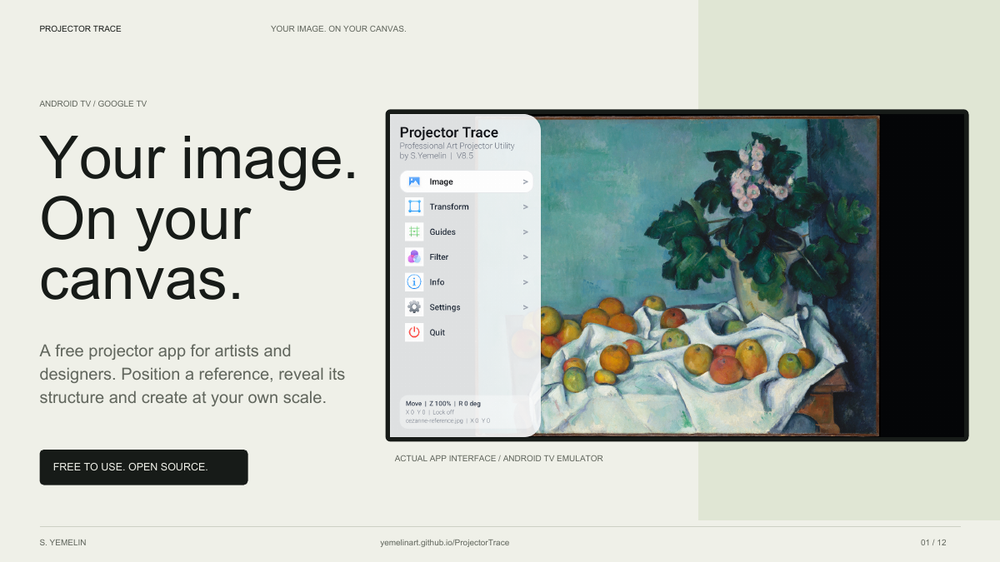

# Projector Trace

[Сайт приложения](https://yemelinart.github.io/ProjectorTrace/) · [Презентация PDF](https://yemelinart.github.io/ProjectorTrace/Projector-Trace-Presentation.pdf)

Приложение для Android TV / Google TV проекторов: выводит референс на холст и позволяет настраивать его обычным пультом.

**Автор: S. Yemelin · 0.9 RC1 — кандидат в Stable 0.9 · Kotlin + Jetpack Compose**

[Скачать тестовый APK](https://github.com/yemelinart/ProjectorTrace/releases/tag/v0.9.0-rc.1) · [English / сборка из исходников](README.md)

## Возможности

Перемещение, масштабирование, поворот и отражение изображения; коррекция перспективы по углам; обрезка; сетка, линейки, рамки и направляющие; фильтры для переноса рисунка; цветовая палитра; сохранение профиля; блокировка настроек.

В Settings можно менять ориентацию рабочей сцены и включать Blink: изображение/чёрный, изображение/белый или сравнение вариантов обработки.

## Установка и управление

Скачайте `ProjectorTrace-0.9.0-rc.1-test.apk` из Releases, перенесите на проектор и откройте файловым менеджером. Если Android попросит, разрешите установку из этого приложения. Требуется Android 6.0 или новее; приложение рассчитано на Android TV и D-pad пульт.

Откройте изображение через Image → Gallery или Browse Files. Выберите инструмент в Transform, Guides или Filter и управляйте стрелками. «Назад» закрывает текущие элементы управления и затем выводит на главный экран TV. Menu переключает меню; «Вправо» открывает его с холста. В меню стрелки вверх/вниз выбирают пункт, вправо открывает его, влево возвращает назад. Действие OK зависит от выбранного инструмента. При включённом Blink и закрытых меню OK переключает вид.

## Исходники

Откройте папку проекта в Android Studio. Подробные зависимости и команды сборки указаны в английском README.

Рабочая папка старого проекта не сохранилась по прежнему адресу. Код восстановлен из истории разработки Codex до версии 8.5, графические ресурсы — из оригинального APK. Сохранившийся APK опубликован отдельно как оригинальная debug-сборка. Проверку на физическом проекторе после восстановления не проводили.

Лицензия проекта — [MIT](LICENSE).

## На пути к Stable 0.9

Текущая версия — **0.9.0-rc.1**, кандидат в стабильный релиз. В неё входят проверенные исправления 8.5.1; новые функции из планов пока не реализованы. Номера 8.x относились к разработке. Публичная серия начинается с 0.9, а внутренний код обновления Android повышен до 900.

APK оптимизирован и подписан тестовым сертификатом. AAB не подписан. Для публикации в Play нужен постоянный ключ и оставшиеся проверки. Обновление установленной версии требует совпадающей подписи; при отказе Android не удаляйте рабочую версию без сохранения своего рабочего набора настроек.

[Визуальный журнал](https://yemelinart.github.io/ProjectorTrace/releases.html) · [Изменения](CHANGELOG.md) · [Планы](ROADMAP.md) · [Аудит](docs/AUDIT-2026-09-22.md) · [Подготовка к Google Play](docs/PLAY-READINESS.md)
